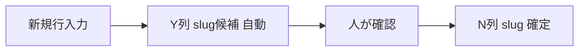

# slug候補列 — 既存 N 列を壊さない運用

## 方針

| 列 | 役割 | 入力 |
|----|------|------|
| **N列 `slug`** | サイトが使う **正式 slug**（既存URL） | **手入力のみ**（プルダウン入力規則は **削除推奨**・既存行は数式にしない） |
| **Y列 `slug候補`**（新規） | 新規行用の **案** | **数式**（N が空のときだけ表示） |

※ X列は **競技カテゴリ** 使用中のため、slug候補は **Y列** に置く。

- サイトが読むのは CSV の **`slug` 列だけ**（`slug候補` は無視される）
- **N列の既存値は一切変更しない**
- 新規行: N を空 → slug候補を確認 → 問題なければ **N に値のみコピー**

---

## 列を足す位置（重要）

**N列と O列のあいだに列を挿入しないでください。**  
O・P 列の学校マスター数式の位置がずれます。

1. **X列 `競技カテゴリ` の右**に列を1本追加
2. **Y1** にヘッダー **`slug候補`** と入力

現在の右端構成（参考）:

```
… W:公開  X:競技カテゴリ  →  Y:slug候補（新規）
```

---

## Y2 に入れる数式

### 基本（1行ずつ・Y2 に貼って下までコピー）

**カンマ区切り:**

```gs
=IF($N2<>"","",
 IF($A2="","",
  TRIM(REGEXREPLACE(
    LOWER(REGEXREPLACE(REGEXREPLACE(
      GOOGLETRANSLATE(
        TEXTJOIN(" ",TRUE,$D2,$E2,$F2,$A2),
        "ja","en"
      ),
      "[^a-zA-Z0-9 -]",""
    )," +","-")),
    "-+$",""
  ))
 ))
```

**セミコロン区切り（日本語設定）:**

```gs
=IF($N2<>"";"";
 IF($A2="";"";
  TRIM(REGEXREPLACE(
    LOWER(REGEXREPLACE(REGEXREPLACE(
      GOOGLETRANSLATE(
        TEXTJOIN(" ";TRUE;$D2;$E2;$F2;$A2);
        "ja";"en"
      );
      "[^a-zA-Z0-9 -]";""
    );" +";"-"));
    "-+$";""
  ))
 ))
```

### 動き

| N列 slug | 結果 |
|----------|------|
| 既に入っている | slug候補は **空**（既存を壊さない） |
| 空で A〜に文字あり | 学校名・部活名・企業名・投稿タイトルを英訳して `kebab-case` 化 |
| 空でタイトルも空 | 空 |

`GOOGLETRANSLATE` は **あくまで候補** です。固有名詞は手で直してから N 列へコピーしてください。

---

## 500行以上（ARRAYFORMULA + MAP）— **正式版**

**Y2 のみ**に貼り、Y3 以降は空のまま。

```gs
=ARRAYFORMULA(
 IF((LEN($N2:N)>0)+(LEN($A2:A)=0),"",
  MAP($A2:A,$D2:D,$E2:E,$F2:F,
    LAMBDA(a,d,e,f,
      TRIM(REGEXREPLACE(
        LOWER(REGEXREPLACE(REGEXREPLACE(
          GOOGLETRANSLATE(TEXTJOIN(" ",TRUE,d,e,f,a),"ja","en"),
          "[^a-zA-Z0-9 -]",""
        )," +","-")),
        "-+$",""
      ))
    )
  )
 )
)
```

**使わない式**（GOOGLETRANSLATE が列全体を一度に処理し、行ごとの候補が出ない）:

```gs
GOOGLETRANSLATE(TEXTJOIN(" ",TRUE,$D2:D,$E2:E,$F2:F,$A2:A),"ja","en")
```

`MAP` / `LAMBDA` が使えない環境では、上の「基本（1行ずつ）」を **Y2 に貼って下までコピー**してください。

---

## 新規行の運用フロー

1. 投稿タイトル・学校名・部活名などを入力（**N列 slug は空のまま**）
2. **Y列 slug候補** が自動表示される
3. 候補を確認し、必要なら英語表記を手直し（Y列は値に変換して編集しても可）
4. 確定した文字列を **N列に「値のみ貼り付け」**
5. N列に入ったら、同じ行の slug候補は **空になる**（数式の仕様）



---

## やってはいけないこと

| NG | 理由 |
|----|------|
| N列全体に数式を入れる | 既存 slug・URL が壊れる |
| N と O の間に列挿入 | 学校マスター数式（O・P）がずれる |
| slug候補をそのまま公開せず N が空 | サイト側で slug 未設定になる |

---

## サイト連携

- 必須列 **`slug`**（N列）は従来どおり
- **`slug候補`** は CSV に含まれてもアプリは読みません（列名が `slug` でないため）
- 列を増やしたら **ウェブに公開（CSV）** を再確認
