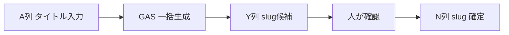

# slug候補 自動生成（Apps Script）

シート1の **A列 投稿タイトル** から **Y列 slug候補** を AI（Gemini）で一括生成します。

---

## ファイル

| ファイル | 用途 |
|---------|------|
| `scripts/google-apps-script/slug-candidate-generator.gs` | メインロジック |
| `scripts/google-apps-script/slug-candidate-sidebar.html` | サイドバーUI（ボタン1つ） |

---

## セットアップ

### 1. Apps Script に追加

1. スプレッドシート「学校・部活検索データ」を開く
2. **拡張機能 → Apps Script**
3. 上記2ファイルの内容をプロジェクトに追加  
   - `.gs` → スクリプトエディタ  
   - `.html` → **ファイル → 新規 → HTML** で `slug-candidate-sidebar` という名前で作成

### 2. Gemini API キー（推奨）

1. [Google AI Studio](https://aistudio.google.com/apikey) で API キーを取得
2. Apps Script → **プロジェクトの設定 → スクリプト プロパティ**
3. プロパティ名 **`GEMINI_API_KEY`** にキーを設定

未設定の場合は **LanguageApp 翻訳 + ルールベース** のフォールバックで動作します（SEO品質は Gemini 推奨）。

### 3. Y2 数式の削除

Y2 に **slug候補の ARRAYFORMULA** がある場合は **削除**してください。  
GAS が Y列に値を書き込むため、数式と競合します。

N列 slug は **引き続き手入力のみ**（変更しません）。

### 4. 初回承認

1. スプレッドシートを再読み込み
2. メニュー **slug候補 → 一括生成パネルを開く**
3. 初回は Google の権限承認を許可

---

## 使い方

### 基本運用：20件ずつ（推奨）

1. メニュー **slug候補 → 一括生成パネルを開く**（または **次の20件を生成**）
2. **「次の20件を生成」** をクリック
3. 未生成が残っていれば **同じボタンを繰り返す**
4. Y列を確認 → **N列 slug に値のみ貼り付け**

LanguageApp フォールバック時は **translate 呼び出し間隔 1秒** を空けてタイムアウト・レート制限を回避します。

### 全件一括（上級者向け）

**slug候補 → 全記事を一括生成** … 件数が多いと 6 分制限でタイムアウトしやすいため非推奨。

---

## 生成ルール

| 条件 | 動作 |
|------|------|
| Y列に値あり | **変更しない** |
| A列が空 | **空のまま**（書き込まない） |
| N列 slug あり | Y列は触らない（生成しない）※Nの値は重複判定に使用 |
| 上記以外 | AI で slug 生成 → Y列へ |

## 生成ルール（識別子型）

- **最大5単語**（ハイフン区切り）
- **英作文禁止** — SEO記事URLではなく DB 識別子
- **タイトル要約型** — キーワード2〜4個が目安
- **日本固有文化 → ローマ字優先**（mikoshi, dekotora, yosakoi）
- 略語 OK: med, ortho, uni, 30m-yen

| タイトル | slug |
|---------|------|
| すすきの祭り 神輿を担ぐ | `susukino-mikoshi` |
| すすきの祭り最終日レポ | `susukino-festival-final-day` |
| 札幌医科大学医学部整形外科学講座 | `sapporo-med-ortho` |
| 1台3000万円のデコトラ | `dekotora-30m-yen` |

**slug 形式**

- 小文字英数字とハイフンのみ
- スペース → ハイフン
- 記号・絵文字・句読点は削除
- 重複時 `-2`, `-3` …（N列確定 slug も含めて一意化）

**AI 出力例（Gemini）**

| 投稿タイトル | slug候補 |
|-------------|----------|
| 北海道大学YOSAKOI | `hokkaido-university-yosakoi` |
| 札幌消防局 | `sapporo-fire-department` |
| 北海道立北の森づくり専門学院 | `hokkaido-forest-college` |

---

## 運用フロー

---

## トラブルシュート

| 症状 | 対処 |
|------|------|
| メニューが出ない | ページ再読み込み / `onOpen` を手動実行 |
| 権限エラー | スクリプト承認を再実行 |
| Gemini エラー | API キー・課金・クォータを確認。フォールバックで生成される |
| Y に `#REF!` | Y2 数式を削除してから再実行 |
| 6分でタイムアウト | `SLUG_CONFIG.batchSize` を小さく（.gs 内） |

---

## サイト連携

- アプリが読むのは **N列 `slug` のみ**
- **Y列 `slug候補`** は CSV に含まれても無視されます
- 確定後 `npm run verify:slugs` で既存 slug 無変更を確認
