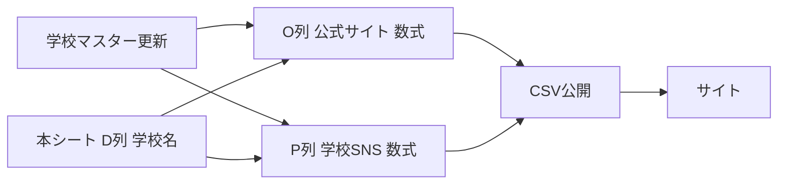

# 学校マスター（500件以上運用向け）

**原則:** 学校情報は「学校マスター」シートだけを更新する。メインシートの **O列・P列は数式のみ**（手入力しない）。

| シート | 役割 |
|--------|------|
| **学校マスター** | 学校名・公式サイト・SNS・ロゴURLの唯一の正 |
| **本シート**（1枚目） | 記事データ。D列の学校名で O・P を自動参照 |

---

## 1. 学校マスターシートを作る

### 列定義（1行目ヘッダー）

| 列 | 項目 | 用途 |
|----|------|------|
| A | 学校名 | 本シート D列と **完全一致** で照合 |
| B | 学校公式サイト | → 本シート **O列** |
| C | 学校SNS | → 本シート **P列** |
| D | 学校ロゴURL | 将来用（本シートには未連携） |

### 初期データの取り込み

リポジトリの CSV を使う場合:

```
data/学校マスター.csv
```

1. シート名を **`学校マスター`** にする（名前が違うと数式が `#REF!` になります）
2. **ファイル → インポート → アップロード** → 上記 CSV
3. **現在のシートを置換**、1行目をヘッダーとして取り込み

すでに登録済みの学校 7 校 ＋ **星槎道都大学**（`https://www.seisadohto.ac.jp/`）を含みます。

---

## 2. メインシートに数式を入れる（手入力禁止）

**事前:** O列・P列の **既存の手入力値をすべて削除** してから数式を入れてください。

データ行は **2行目〜**。1行目はヘッダーのまま。

| 本シート列 | 内容 | 入力方法 |
|------------|------|----------|
| D | 学校名 | 手入力 or 記事入力 |
| O | 学校公式サイト | **数式のみ** |
| P | 学校SNS | **数式のみ** |

### 500行以上向け：O2・P2 に ARRAYFORMULA（推奨）

**O2** に貼り付け（O3 以降は空のまま）:

```gs
=ARRAYFORMULA(IF(LEN(D2:D)=0,"",IFERROR(VLOOKUP(TRIM(D2:D),学校マスター!$A$2:$D,2,FALSE),"")))
```

**P2** に貼り付け（P3 以降は空のまま）:

```gs
=ARRAYFORMULA(IF(LEN(D2:D)=0,"",IFERROR(VLOOKUP(TRIM(D2:D),学校マスター!$A$2:$D,3,FALSE),"")))
```

日本語ロケール（引数は **セミコロン**）:

```gs
=ARRAYFORMULA(IF(LEN(D2:D)=0;"";IFERROR(VLOOKUP(TRIM(D2:D);学校マスター!$A$2:$D;2;FALSE);"")))
```

```gs
=ARRAYFORMULA(IF(LEN(D2:D)=0;"";IFERROR(VLOOKUP(TRIM(D2:D);学校マスター!$A$2:$D;3;FALSE);"")))
```

`$A$2:$D` はマスター行が増えても自動で下まで参照します（A1 はヘッダーのため 2 行目から）。

### XLOOKUP 版（利用できる場合）

**O2:**

```gs
=ARRAYFORMULA(IF(LEN(D2:D)=0,"",IFERROR(XLOOKUP(TRIM(D2:D),学校マスター!$A$2:$A,学校マスター!$B$2:$B),"")))
```

**P2:**

```gs
=ARRAYFORMULA(IF(LEN(D2:D)=0,"",IFERROR(XLOOKUP(TRIM(D2:D),学校マスター!$A$2:$A,学校マスター!$C$2:$C),"")))
```

---

## 3. 運用フロー（全記事へ自動反映）



1. **新しい学校** → 学校マスターに 1 行追加（A〜D）。本シートは触らない。
2. **URL 変更** → マスターの B または C のみ修正 → 同じ D列の行はすべて O・P が再計算される。
3. **新規記事** → D列に学校名を入れるだけ。O・P は自動。
4. サイト反映 → 既存どおり **ウェブに公開（CSV）**。数式の**表示値**がエクスポートされる。

---

## 4. マスター品質（500件時の注意）

- **学校名の重複禁止**（A列）。重複があると VLOOKUP は先頭行のみ参照。
- 本シート D列とマスター A列は **表記ゆれゼロ**（「札幌大学」と「札幌大学 」は不可 → `TRIM` で緩和のみ）。
- マスターが未登録の学校名 → O・P は空（エラーは出さない）。
- **学校ロゴURL** はマスター D列のみ保管。サイト連携時に列を追加予定。

### 本シートにだけある学校名を洗い出す

```bash
npm run school-master:audit
```

メイン CSV から D列のユニーク一覧を出し、マスター未登録を確認できます。

---

## 5. サイト連携

- 列名 **学校公式サイト** / **学校SNS** は変更しない（`types/post.ts` と一致）。
- 列を増減したら **ファイル → 共有 → ウェブに公開** を再確認。
- 編集用 URL は `.env.local` の `EDIT_URL` コメント参照。
