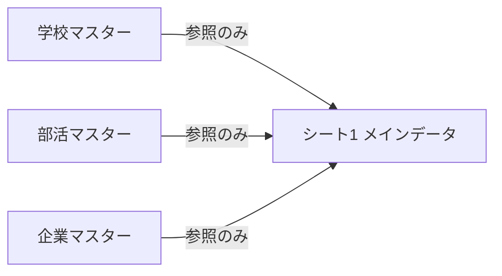

# 札幌未来図鑑 データベース構築状況（2026/5/31 更新）

Googleスプレッドシート **「学校・部活検索データ」** を本番DBとして運用しています。

---

## 設計原則（循環参照を防ぐ）



| OK | NG |
|----|-----|
| シート1 → 各マスターを **VLOOKUP / INDEX+MATCH** | マスターが **シート1の列を参照** |
| マスターの結合列 **E（キー）** は A・B のみ使用 | `QUERY(シート1!…)` でマスターを **自動再生成** し、シート1がそれを参照 |
| マスターは **手入力・プルダウン** で更新 | IMPORTRANGE でシート1とマスターを **相互参照** |

**以前の循環参照:** シート1 → 部活マスター生成 → シート1 がその結果を参照 → エラー。  
**現在:** マスターは独立。シート1はマスターを **読むだけ**。

---

## 完了済み

### 数式セットアップ（①②③）— 2026/5/31 動作確認済み

| セル | 列 | 状態 |
|------|-----|------|
| Q2 | 部活SNS | ✅ VLOOKUP + 複合キー |
| X2 | 競技カテゴリ | ✅ 同上（C列参照） |
| Y2 | slug候補 | ✅ MAP + GOOGLETRANSLATE |
| O2 / P2 | 学校公式・SNS | ✅ 従来どおり |

検証: `npm run verify:autofill` / `npm run verify:slugs`（既存 slug 44件 無変更）

### シート1（メインデータ）

基本列: 投稿タイトル / ジャンル / エリア / 学校名 / 部活名 / 企業名 / 動画カテゴリ / 進路カテゴリ / 募集情報 / InstagramURL / 画像URL / 投稿日 / 説明文 / **slug（N列）**

追加列: 学校公式サイト / 学校SNS / 部活SNS / 企業公式サイト / 企業SNS / 募集情報URL / 人気表示 / 人気順 / 公開 / **競技カテゴリ（X列）**

### 学校マスター

| A | B | C |
|---|---|---|
| 学校名 | 学校公式サイト | 学校SNS |

学校名プルダウン済み。シート1の O・P 列から自動取得 **動作中**。

### 部活マスター

| A | B | C | D | E（推奨） |
|---|---|---|---|---|
| 部活名 | 学校名 | 競技カテゴリ | 部活SNS | **キー**（数式） |

- E1: `キー`
- E2 以降: `=A2&"|"&B2`（**部活マスター内だけ**の式。シート1を参照しない）

部活名プルダウン済み。マスターは手動管理（旧・シート1からの自動生成は廃止）。

### 企業マスター

| A | B | C | D |
|---|---|---|---|
| 企業名 | 企業公式サイト | 企業SNS | 採用ページ |

企業名プルダウン済み。シート1から自動取得 **動作中**。

---

## 数式セットアップ（①②③）— 参照用

### 事前準備（部活マスター E列）

1. **部活マスター** の **E1** に `キー`
2. **E2** に `=A2&"|"&B2` を入れ、下までコピー
3. E列は **部活名＋学校名** の照合用（シート1の `E列&"|"&D列` と一致）

---

### ① 競技カテゴリ（X列）

**X2** に貼り付け（X3 以降は空でOK）。既存の誤った式は **削除してから** 入れ替え。

```gs
=ARRAYFORMULA(IF(LEN($E2:$E)=0,"",IFERROR(VLOOKUP(TRIM($E2:$E)&"|"&TRIM($D2:$D),{'部活マスター'!$E$2:$E,'部活マスター'!$C$2:$C},2,FALSE),"")))
```

- 照合: **部活名（E）＋学校名（D）** → 部活マスター E列
- 取得: 部活マスター **C列（競技カテゴリ）**
- 部活名だけの VLOOKUP は **使わない**（別校の同名部活で誤取得）

---

### ② 部活SNS（Q列）

**Q2** に貼り付け（Q3 以降は空でOK）。**Q2 が空だと Q 列全体が空**になるので必須。

```gs
=ARRAYFORMULA(IF(LEN($E2:$E)=0,"",IFERROR(VLOOKUP(TRIM($E2:$E)&"|"&TRIM($D2:$D),{'部活マスター'!$E$2:$E,'部活マスター'!$D$2:$D},2,FALSE),"")))
```

- 照合: Q・X と同じ（E列|D列 → 部活マスター E列）
- 取得: 部活マスター **D列（部活SNS）**

---

### ③ slug候補（Y列・新規）

**N列 slug は触らない。** 既存行（例: `sapporo-fire-school`）はそのまま。

1. **X列の右**に列追加 → **Y1** = `slug候補`
2. **Y2**（**Y2 未設定だと slug候補が全行空**）:

```gs
=ARRAYFORMULA(
 IF((LEN($N2:N)>0)+(LEN($A2:A)=0),"",
  MAP($A2:A,$D2:D,$E2:E,$F2:F,
    LAMBDA(a,d,e,f,
      TRIM(REGEXREPLACE(
        LOWER(REGEXREPLACE(REGEXREPLACE(
          GOOGLETRANSLATE(TEXTJOIN(" ",TRUE,d,e,f,a),"ja","en"),
          "[^a-zA-Z0-9 -]",""
        )," +","-")),
        "-+$",""
      ))
    )
  )
 )
)
```

**運用:** Y列で候補確認 → 確定したら **N列に値のみ貼り付け**。N が空の間だけ Y に候補が出る。

---

## 列対応早見表（シート1）

| 列 | 項目 | 入力 | 参照元 |
|----|------|------|--------|
| D | 学校名 | プルダウン / 手入力 | 学校マスター |
| E | 部活名 | プルダウン / 手入力 | 部活マスター |
| F | 企業名 | プルダウン / 手入力 | 企業マスター |
| N | slug | **手入力（確定値）** | — |
| O | 学校公式サイト | 数式 | 学校マスター |
| P | 学校SNS | 数式 | 学校マスター |
| Q | 部活SNS | 数式 | 部活マスター D |
| X | 競技カテゴリ | 数式 | 部活マスター C |
| Y | slug候補 | 数式 | N空欄時のみ |

---

## 次の工程（データ整理 → サイト確認）

| 順 | 作業 | 担当 | 状態 |
|----|------|------|------|
| 1 | slug 未確定 9 行の N 列確定（Y列候補 → 値のみ貼り付け） | スプレッドシート | 未着手 |
| 2 | テスト記事行を **非公開** または削除 | スプレッドシート | 未着手 |
| 3 | タイトル空の行（約67行）を **非公開** にするか行削除 | スプレッドシート | 未着手 |
| 4 | `npm run dev` で部活SNS・競技一覧・人気コンテンツを目視確認 | PC | 未着手 |
| 5 | 本番デプロイ（Vercel 等） | PC | 未着手 |

アプリ側は **タイトル空の行を読み込まない** ように済み（空行によるゴースト投稿を防止）。

---

## バックログ（アプリ側）

| 優先 | 内容 | 状態 |
|------|------|------|
| ④ | 学校検索ページ `/schools` | ✅ 実装済み |
| ⑤ | 部活検索ページ `/clubs` | ✅ 実装済み |
| ⑥ | 競技カテゴリ `/sports`・`/sport/[slug]` | ✅ 実装済み（13競技） |
| ⑦ | 人気順表示 | ✅ 実装済み（人気表示+人気順） |

---

## slug 保護

- **N列に数式は入れない**（既存44件以上の slug を保護）
- 自動案は **Y列 `slug候補` のみ**
- リポジトリに `data/slug-snapshot.json` を保存済み
- 変更検知: `npm run verify:slugs`

## 関連ドキュメント

- **`docs/スプレッドシート_数式一覧.md`** … コピペ用まとめ
- `docs/スプレッドシート_学校マスター.md`
- `docs/スプレッドシート_部活マスター.md`
- `docs/スプレッドシート_slug候補.md`
